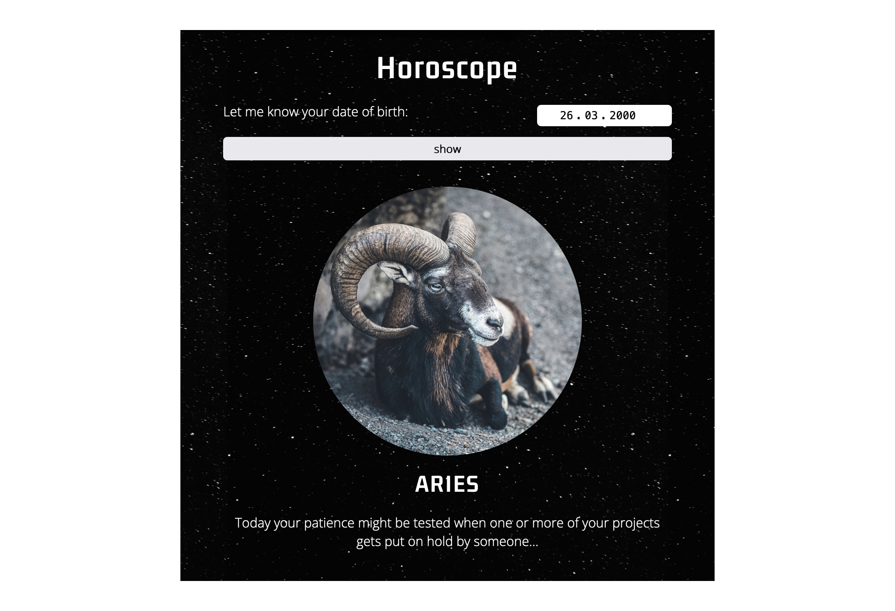

# horoscope-using-if-else-check | Online horoscope

This is a solution for an online horoscope. Simply enter your date of birth and press the button "show" to get some information on what the stars will bringt to you.

## Table of contents

- [Overview](#overview)
  - [The challenge](#the-challenge)
  - [Screenshot](#screenshot)
  - [Links](#links)
- [My process](#my-process)
  - [Built with](#built-with)
- [Author](#author)
- [Acknowledgments](#acknowledgments)

## Overview

### The challenge

In this web app we want to create a small horoscope related to the entered day of birth. You are free with the styling.

### Screenshot

### Links

- Solution URL: [https://github.com/jenniferhubermayer/horoscope-using-if-else-check](https://github.com/jenniferhubermayer/horoscope-using-if-else-check)
- Live Site URL: [https://jenniferhubermayer.github.io/horoscope-using-if-else-check/](https://jenniferhubermayer.github.io/horoscope-using-if-else-check/)

## My process

### Built with

- Semantic HTML5 markup
- CSS custom properties
- Flexbox
- Mobile-first workflow
- JavaScript (Focused on arrays)

## Author

- Website - [https://github.com/jenniferhubermayer](https://github.com/jenniferhubermayer)

## Acknowledgments

This project has been realized as part of the [super(c)ode](https://www.super-code.de/) "Front-End Boot-Camp 2022".
